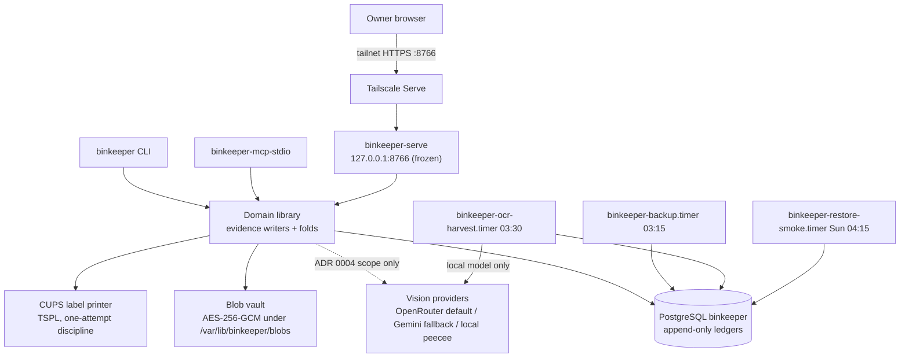

# BinKeeper architecture

BinKeeper tracks physical storage bins — contents, locations, photos, movement
history, and placement recommendations — for one owner on one machine. It was
extracted from Engram ([extraction-analysis.md](extraction-analysis.md)) and
has been the sole physical-inventory authority since the `BINK-11` one-writer
cutover on 2026-07-18. This document describes the system as deployed; the
decisions that shaped it are in [`docs/adr/`](adr/) and the invariants it must
keep are in [README.md](../README.md#invariants).

## The design rule everything follows

Raw evidence is append-only; everything the owner reads is a fold.

- **Evidence** lands in append-only PostgreSQL ledgers. Append-only is
  enforced in the database itself: a `BEFORE UPDATE OR DELETE` trigger raises
  on every evidence table, even against the owner role. Every writer dedupes
  on a stable identity — an `external_id` derived from an idempotency key or
  a canonical content hash (the plaintext hash for blobs, the phrase/source
  natural key for liveness) — enforced either by `ON CONFLICT DO NOTHING` or
  by an advisory-locked check-then-insert (containment, blob vault,
  captures), so replays are no-ops that report `already_existed`.
- **Derived state** — a bin's location, its passport, the review queues, the
  catalog — is computed at read time by pure folds over that evidence. No
  mutable "current state" row exists anywhere. A bin's location is the fold
  of its move events; a packed bin's effective location is its outermost
  container's fold.
- **Uncertain answers abstain.** Confidence decays with each bin's own
  observed movement rhythm; folds return explicit abstain reasons
  (`no_current_presence`, geofence ambiguity, sub-floor routing scores)
  instead of guessing.
- **Advisory lanes corroborate, never command.** Vision output, GPS
  harvests, OCR, co-location witnesses, and routing recommendations can at
  most refresh confidence in what the move ledger already says, queue a
  proposal for the owner, or (once a source has earned trust) append a gated
  `contradict` shock that shakes confidence without moving the bin; only an
  explicit owner action (or the owner's own trip scan) appends a
  location-changing move event.

## System context

Everything runs on this host. The only bytes that ever leave are the advisory
vision lane's downscaled inference JPEG and prompt text, sent to the
configured cloud vision provider under ADR 0004's scope (see
[What leaves the machine](#what-leaves-the-machine)).

## Write authority

There is exactly one writer, and it is fail-closed at three independent
layers:

1. **Process gate.** `BINKEEPER_WRITES_ENABLED=1` is required by
   `write_authority.require_writer_authority()`. It is enforced at every
   mutation boundary: an HTTP middleware returns 503 for non-safe methods
   before any handler runs, `cli.execute` checks the seven mutating
   subcommands before touching the database, and MCP inherits the CLI check
   because `mcp.call_tool` delegates into `cli.execute`. The gate has been
   open in production since the `BINK-11` cutover; it stays `0` in every
   rehearsal install.
2. **Database roles.** Read paths use `connect(role="serving")`, which does
   `SET ROLE binkeeper_serving` — a `SELECT`-only role — and fails closed if
   the role is missing. Writers use the owner role.
3. **Append-only triggers.** Even the owner role cannot `UPDATE` or `DELETE`
   evidence; the triggers raise regardless of who asks.

The library-level writers (`record_event`, `record_observation`,
`PersonalMemoryService.capture`) are deliberately ungated — enforcement lives
at the process boundaries, so tests can exercise the domain directly.

## Evidence ledgers and their folds

| Ledger | Appended by | Folded into |
|---|---|---|
| `bin_trip_events` | trip scans (CLI/MCP), registration, manage-page placement and retrieval verdicts, containment unpacks (a derived `place` at the container's site), gated contradiction shocks | current location (`bin_where`), trip checksums (`unaccounted`), location belief with decay, confusion streaks, per-bin half-life |
| `location_observations` | `photo_gps` and `peripheral_ocr` harvesters | same-site corroboration inside `bin_belief`; per-source reliability (read-time Beta posterior adjudicated against the move ledger) |
| `capture_evidence` / `captures` | registration, profile snapshots, photo capture-links, print intents, virtual-bin definitions, wave completions | bin passports, virtual-bin membership, current-lane search |
| `bin_containment_events` | owner pack/unpack (CLI, MCP, manage page) | single-parent acyclic containment graph; effective location of packed bins |
| `bin_presence_events` | library-only writer (no deployed surface yet) | owner site-presence fold gating sweeps |
| `bin_resting_order_events` | library-only writer | active resting orders ("confirm this bin next time you're at the shop") |
| `bin_routing_requests`, `bin_placement_decisions`, `stash_runs` | route/stash surfaces and deck taps | owner-correction fold that enriches passports, wave plans, quorum-birth clusters |
| `colocation_observations` | QR geometry harvest from dropped/managed photos | witnessed-shelf containment belief with anchor demotion |
| `bin_item_liveness` | offline liveness adapter (contract exists; not wired to any deployed surface) | decayed item-recency scores feeding the router's `history_fit` bonus |
| `evidence_blobs` | photo uploads via the blob vault | vault reads, on-the-fly catalog thumbnails, backup inventory |

Schema lives in checksum-pinned forward migrations
(`src/binkeeper/migrations/sql/`); a changed applied file raises
`MigrationDriftError`. Tenant/corpus scoping (`personal`/`personal` by
default) rides on every ledger table and every idempotency index (the
extraction-era `capture_sources` compatibility table is the one unscoped
exception).

## Subsystems

### Evidence core (`bin_inventory`, `migrations`, `database`, `write_authority`)

The ledger schema, the connection seam, the writer gate, and the belief math.
Location belief starts from the move-event fold, decays exponentially on the
bin's own median movement gap, takes shocks from `contradict`/`not_found`
events, and is then MAX'd against the best same-site corroborating
observation weighted by that source's earned reliability. Source reliability
is never stored: it is a read-time Beta posterior over each source's track
record, adjudicated against the move ledger as ground truth (priors: manual
0.9, `photo_gps` and `gps_dwell` 0.8, `peripheral_ocr` 0.6,
`transcript_deixis` 0.33; unknown sources start neutral at 0.5). Cross-site
observations never move a bin — at most they may become a gated `contradict`
shock, and emission is default-off until a source earns trust. Belief-gated
serving (`BINKEEPER_BIN_BELIEF_ENABLED`) is instrument-first: off by
default, and the gate is not yet wired into any read path — today the flag
only stamps `serving_enabled` in the `bin_belief` instrument, so `bin_where`
is byte-identical regardless of its value.

### Derived views (`bin_passport`, `bin_presence`, `bin_priority`, `bin_sweep`, `bin_virtual`, `bin_colocation`, `bin_anchor`, `bin_liveness`, `search`, `bin_volume`, `bin_orders`)

The read-time projection layer. Passports fold captures, belief, and the
containment graph into per-bin placement profiles with provenance refs.
Re-confirmation priority is expected regret × reachability, so far-away bins
sink instead of nagging ("never ask for a special trip"); the BINK-20
confusion streak (browse-without-taking events) inflates cost-of-being-wrong
and flips the sweep prompt from "confirm location" to "open and check
contents". Sweeps are presence-gated and batch by witnessed shelf (LOC-
anchors), amortizing one shelf photo across every member bin. Anchors unseen
for 180 days demote — a fold outcome, not a mutation. Virtual bins reorganize
the index, never the shelves: append-only owner queries evaluated over
passports at read time. Search runs two lanes — current passports first, then
imported historical evidence explicitly labeled `is_current=false` — with no
network or model imports.

### Placement and stash (`bin_route`, `bin_placement`, `bin_placement_feedback`, `bin_stash`)

"Which bin should this go in?" answered by a pure text router over passports
that abstains rather than guesses (placement floor 0.60, close-tie and
wrong-site filters; zero false placements across the BINK-24 spike's 96
routed decisions — see [stash-spike.md](stash-spike.md)). Every route is an
immutable receipt; every owner decision over a receipt is append-only
evidence. A read-only fold projects surviving corrections back into passports
additively (an override both accepts the chosen bin and excludes the wrong
recommendation), so the router learns vocabulary without any past receipt
changing. Batch stash runs partition items into a swipeable deck versus a
pending pile and compile wave plans that open each destination bin exactly
once; enough mutually-similar orphans can found a new bin through
owner-approved `create_new_bin` decisions.

### Vision, geofence, and harvests (`bin_vision`, `bin_geo`, `bin_harvest`, `bin_ocr_harvest`, `sites`, `bin_register`, `bin_label`, `bin_vision_bench`)

All vision flows share one `VisionClient` seam with three backends selected
by `BINKEEPER_BIN_VISION_PROVIDER`: `openrouter` (default, ADR 0005),
`gemini` (fallback), `local` (peecee Ollama, the no-cloud rollback). The
OpenAI-compatible client doubles as the OpenRouter client — an API key just
adds a bearer header. Model names are configuration, never code (two Gemini
models retired mid-project). The architecture is two-pass by owner
constraint — interactive photo-drop latency is binding: the deployed default
runs ~4.3 s and the 13–21 s ensembles are excluded from the first pass
(ADR 0005):

| Lane | Model | Runs | Exports |
|---|---|---|---|
| Interactive first pass (photo drop) | hosted `qwen/qwen3-vl-32b-instruct` via OpenRouter | on photo drop, advisory label proposal | downscaled JPEG + prompt (ADR 0004/0005) |
| Nightly peripheral-OCR true-up | local `qwen3-vl:32b` on peecee | `binkeeper-ocr-harvest.timer`, 03:30 | nothing (pinned `--local-only`) |
| Label-drift review queue (ADR 0006, accepted, not yet built) | `claude-opus-5` + local `qwen3-vl:8b` union ensemble | nightly, input-keyed | downscaled JPEG + prompt via OpenRouter to Anthropic |

Geofencing resolves a photo's EXIF GPS against owner-local site anchors and
abstains on ambiguity or a fix looser than 100 m. The site *vocabulary*
(slugs, bin-code prefixes, radii) is code (`sites.py`); the *coordinates*
are owner-local data in a gitignored 0600 `sites.json` — canonically
`~/.config/binkeeper/sites.json`. The nightly OCR harvester resolves the
geofence before spending a vision call, accepts only codes the registry
already knows, and can therefore refresh known bins but never mint one.
Printed labels are pure-rendered TSPL (QR + human code + base-36 check
badge) behind the one-attempt print discipline: a durable print-intent
capture lands before any printer I/O, replays never reprint, and a CUPS
timeout is reported "unknown", never retried.

The benchmark harness (`scripts/vision_bench.py`) scores candidate backends
over the owner's real photo drops through the production `analyze` seam;
raw results are owner data and stay outside the repo. Sanitized aggregate
records, model/runtime provenance, and hashes binding them to the private raw
evidence are append-only under [`docs/benchmarks/`](benchmarks/). ADR 0005's
default was selected this way after the benchmark showed ADR 0004's
anecdote-chosen default scored worst of the live candidates.

### Media and durability (`blob_vault`, `bin_photo_media`, `backup`, `restore_drill`, `transfer`)

Photos live as content-addressed AES-256-GCM ciphertext in the blob vault
(filesystem or local/tailnet Garage S3 — the store constructor hard-rejects
non-local endpoints). `open_blob` verifies ciphertext hash, AEAD tag, and
plaintext hash, in that order. Thumbnails are derived per request from
decrypted originals and carry no EXIF. Nightly backups are atomic artifacts:
a chunk-encrypted `pg_dump` sharing one repeatable-read snapshot with an
HMAC-signed manifest of every protected dimension (row counts and seals,
folds, passports, route receipts, blob hashes) plus byte-exact blob
ciphertexts; the backup key must differ from the vault key. `/readyz`
re-verifies artifact authenticity and freshness on every probe. A weekly
drill restores the newest artifact into a disposable `binkeeper_restore_*`
database, recomputes the protected state with time pinned to the manifest,
and requires exact equality. `binkeeper-transfer` is the pinned
export/stage-blobs/import contract that executed the cutover and remains the
tool for rehearsals.

### Owner surfaces (`service`, `bin_photo_web`, `bin_catalog_web`, `web`, `cli`, `mcp`, `bin_manage`, `bin_nesting`)

One FastAPI service, frozen to `127.0.0.1:8766` (the parser errors on any
other bind) and fronted by tailnet HTTPS at
`https://proximal.tail0ecc2e.ts.net:8766`, composes the authoring surface at
`/` (photo drop with advisory label proposal, zero-typing registration,
existing-bin management, stash deck) with the read-only catalog at `/bins/`
(fog-of-war confidence buckets, witnessed shelves, virtual bins, vault
thumbnails). Reviewed POST actions sit behind a strict origin guard with a
paired-origin allowlist and a legible refusal contract; every owner action
carries a server-rendered `action_id` folded into its idempotency key, so
replays are no-ops and divergent reuse errors out. The photo drop stores the
original bytes first, as the guaranteed action; vision proposal failure is a
calm, retryable label error, never a lost photo. The CLI (15 subcommands)
and MCP (13 tools) are one surface: MCP reconstructs CLI arguments and calls
the same `execute`, so semantics and the writer gate cannot drift.
`bin-anchor-label` and `bin-ocr-harvest` are deliberately CLI-only.

## Deployment

| Unit | Schedule | Runs | Notes |
|---|---|---|---|
| `binkeeper.service` | persistent | `binkeeper-serve` | hardened; only the blob root writable |
| `binkeeper-backup.timer` | daily 03:15 (+15 m jitter) | `binkeeper-backup create` | writes only `/var/lib/binkeeper/backups` |
| `binkeeper-ocr-harvest.timer` | nightly 03:30 (+15 m jitter) | `binkeeper bin-ocr-harvest --local-only` | autocommit; exit 3 = no geofence, exit 4 = zero codes read |
| `binkeeper-restore-smoke.timer` | Sundays 04:15 (+30 m jitter) | `binkeeper-restore-drill` | disposable `binkeeper_restore_*` target only |

Configuration is layered: `/etc/binkeeper/binkeeper.env` (root-only; database
URL, writer gate, vision provider and keys, backup root) is shared by every
unit, and the OCR harvest layers `/etc/binkeeper/binkeeper-ocr-harvest.env`
after it — systemd's later-file-wins ordering is the mechanism that pins the
nightly lane to the local model regardless of the service's cloud default.
Blob and backup key material lives only in `/etc/binkeeper/blob-vault.json`
(0600). Wheels install to `/opt/binkeeper/venv`. See
[deployment.md](deployment.md) for procedures and
[runbooks/backup-restore.md](runbooks/backup-restore.md) for recovery stop
conditions.

## What leaves the machine

Nothing, except the one standing owner-approved export (ADR 0004): the
advisory vision lane sends the downscaled inference JPEG (bounded long edge,
re-encoded) and the lane's prompt text to the configured cloud vision
provider. Original photo bytes, bin codes, coordinates, and every ledger stay
local. Per lane: the interactive pass exports to OpenRouter (ADR 0005); the
nightly OCR true-up exports nothing and is doubly pinned local (env layering
plus a `--local-only` refusal that aborts before any photo is read); the
accepted-but-unbuilt drift queue will add Anthropic as an upstream via
OpenRouter under the same scope (ADR 0006). Rollback for any lane is
configuration: `BINKEEPER_BIN_VISION_PROVIDER=local` ends all cloud export.

## Decision records

| ADR | Decision |
|---|---|
| [0001](adr/0001-standalone-authority.md) | BinKeeper is a standalone repository, package, and data authority |
| [0002](adr/0002-blob-key-transition.md) | Blob transition = re-encryption under a BinKeeper-owned key |
| [0003](adr/0003-physical-bin-containment.md) | Bin-in-bin containment as an append-only pack/unpack fold |
| [0004](adr/0004-cloud-vision-backend.md) | The advisory vision lane may export downscaled JPEG + prompt to a cloud provider |
| [0005](adr/0005-benchmarked-vision-default.md) | Benchmark-selected OpenRouter Qwen3-VL 32B interactive default |
| [0006](adr/0006-label-drift-review-queue.md) | Async label-drift proposals with an owner review queue (accepted; slices `BINK-42`..`BINK-44`) |

## Known seams and rough edges

- Two `sites.json` defaults exist: `bin_geo` canonically uses
  `~/.config/binkeeper/sites.json` while `bin_harvest` defaults to an
  extraction-era repo-relative path (`scripts/bin-capture/sites.json`) that
  exists in neither a checkout nor a wheel install — deployments must set
  `BINKEEPER_BIN_SITES_FILE` (the OCR harvest pin file does).
- Most tunables are module constants read at import time; changing them needs
  a process restart. Gates and credentials are the exception, re-read per
  use: the writer gate (`BINKEEPER_WRITES_ENABLED`), the placement-feedback
  kill switch (`BINKEEPER_BIN_PLACEMENT_FEEDBACK_ENABLED`), the database
  URL, and the cloud vision API keys.
- The nightly OCR pass re-reads every eligible photo (dedupe is per
  observation, not per photo), so its wall clock grows with the vault;
  revisit before it nears the unit's 4 h `TimeoutStartSec`.
- `db.py` and `inventory.py` are extraction-era compatibility shims
  re-exporting the canonical modules; `photo/` is an empty extraction-era
  resource marker (the app and its templates live in `bin_photo_web`).
- `bin_presence_events`, `bin_resting_order_events`, and the liveness
  adapter have library-complete writers but no deployed surface yet.
